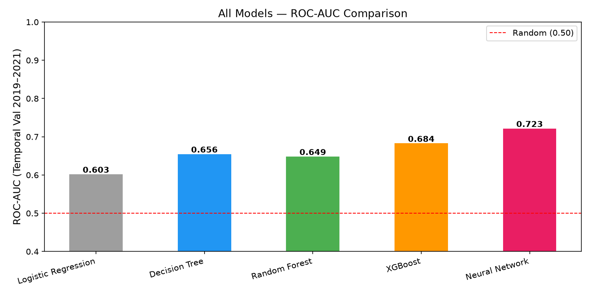

# WFP Maize Price Alert: Machine Learning from EDA to Deployment

Can we tell, from location and time alone, whether a maize market is going through a period of high prices?
This project builds a binary classifier on the **WFP Global Food Prices Database** and takes it through the full
machine learning lifecycle: exploration, regression baseline, classification, evaluation, tree models, experiment
tracking, deep learning and an API for predictions.

Food price spikes are an early signal of food insecurity. A simple, explainable alert model like this one can help
analysts prioritise which markets to monitor more closely.

## Problem and data

- **Data:** WFP Global Food Prices Database (`wfpvam_foodprices.csv`), filtered to retail maize across all countries,
  with outliers removed per country.
- **Target:** `high_price = 1` when the log price of an observation is above the median log price of its country.
  Working in log prices and comparing within each country removes currency scale differences.
- **Features:** country, region (admin 1), currency, a normalised year trend, and month encoded as sine and cosine
  to capture seasonality.
- **Validation:** temporal split. Models are trained on data before 2019 and evaluated on 2019 onwards, so the
  evaluation mimics predicting the future.

## Results (ROC AUC on the 2019+ validation set)

| Model | ROC AUC |
|---|---|
| Logistic regression (baseline) | see `03-classification/` and `04-evaluation/` |
| XGBoost | 0.690 |
| Feedforward neural network (Keras, embedding layers) | **0.745** |



The neural network learns embeddings for country, region and currency, which helps it capture
similarities between markets that one hot encoding misses.

## Project structure

| Module | Content |
|---|---|
| `01-intro/` | ML fundamentals and environment setup |
| `02-regression/` | EDA, cleaning, log price regression baseline, residual analysis |
| `03-classification/` | Logistic regression, threshold tuning, F1 by country |
| `04-evaluation/` | ROC and precision recall curves, confusion matrix, cross validated AUC |
| `05-deployment/` | Model training and a **FastAPI** prediction service, packaged with **Docker** |
| `06-trees/` | Decision tree, random forest, XGBoost with early stopping and feature importance |
| `07-mlflow/` | **MLflow** experiment tracking (SQLite backend) and model registry |
| `08-deep-learning/` | Keras neural network with embeddings, training curves, comparison of all models |
| `09-serverless/`, `10-serving/` | In progress: AWS Lambda and BentoML serving |

## Tech stack

Python, pandas, NumPy, scikit-learn, XGBoost, TensorFlow/Keras, MLflow, FastAPI, Docker, matplotlib, seaborn.

## How to run

```bash
git clone https://github.com/valofils/ml-zoomcamp-practice.git
cd ml-zoomcamp-practice
python -m venv venv
venv\Scripts\activate          # Windows (use source venv/bin/activate on Linux/macOS)
pip install -r requirements.txt
```

Download the WFP Global Food Prices dataset, save it as `data/wfpvam_foodprices.csv`, then run the modules in order:

```bash
python 02-regression/eda.py          # builds data/wfp_maize_clean.csv
python 03-classification/train.py
python 06-trees/train_xgboost.py
python 08-deep-learning/train_cnn.py
```

### Prediction API

```bash
cd 05-deployment
python train.py
uvicorn app:app --reload
```

```bash
curl -X POST http://localhost:8000/predict \
  -H "Content-Type: application/json" \
  -d '{"adm0_name":"Rwanda","cur_name":"RWF","adm1_name":"Kigali City","mp_year":2020,"mp_month":6}'
```

The API returns the predicted class, its probability, and a readable label (`HIGH PRICE ALERT` or `Normal price level`).

### Experiment tracking

```bash
python 07-mlflow/tracking.py
mlflow ui --backend-store-uri sqlite:///<path shown by the script>
```

## Limitations and next steps

- The country median is computed over the whole period, so the label describes relative price level rather than a
  sudden spike. A rolling median or a price change target would make it closer to an early warning signal.
- Features describe place and time only. Adding rainfall, exchange rates or lagged prices should improve performance.

## Related dashboard

[Global Food Price Monitor (WFP, 2015 to 2024) on Tableau Public](https://public.tableau.com/app/profile/mariel.ambratis.fils.andrianavalondrahona/viz/GlobalFoodPriceMonitorWFP2015-2024/Dashboard1)

## Author

Mariel Andrianavalondrahona, statistician engineer, Antananarivo, Madagascar · [github.com/valofils](https://github.com/valofils)
